# 常用求导公式（一元函数微分学）

> 📌 **本章内容**：基本初等函数求导、四则运算、链式法则、隐函数、参数方程、对数求导、高阶导数、反函数、分段函数、变限积分求导

---

## 一、基本初等函数求导公式

| 函数 | 导数 | 记忆要点 |
|:---|:---|:---:|
| $C$（常数） | $0$ | — |
| $x^\mu$（$\mu\in\mathbb{R}$） | $\mu x^{\mu-1}$ | 指数提前，指数减一 |
| $a^x$（$a>0$） | $a^x \ln a$ | 自身 $\times \ln a$ |
| $e^x$ | $e^x$ | 不变，最特殊的指数函数 |
| $\log_a x$（$a>0,a\neq1$） | $\dfrac{1}{x\ln a}$ | 分母多 $\ln a$ |
| $\ln x$ | $\dfrac{1}{x}$ | — |
| $\sin x$ | $\cos x$ | 余函数 |
| $\cos x$ | $-\sin x$ | 负的正弦 |
| $\tan x$ | $\sec^2 x = \dfrac{1}{\cos^2 x}$ | 正割平方 |
| $\cot x$ | $-\csc^2 x = -\dfrac{1}{\sin^2 x}$ | 负的余割平方 |
| $\sec x$ | $\sec x \tan x$ | 自身 $\times \tan x$ |
| $\csc x$ | $-\csc x \cot x$ | 负的自身 $\times \cot x$ |
| $\arcsin x$ | $\dfrac{1}{\sqrt{1-x^2}}$ | — |
| $\arccos x$ | $-\dfrac{1}{\sqrt{1-x^2}}$ | 与 $\arcsin x$ 相反数 |
| $\arctan x$ | $\dfrac{1}{1+x^2}$ | — |
| $\operatorname{arccot} x$ | $-\dfrac{1}{1+x^2}$ | 与 $\arctan x$ 相反数 |

> 💡 **记忆口诀**：
> - **正弦余弦**：$\sin$ 求导变 $\cos$，$\cos$ 求导变 $-\sin$
> - **正割余割**：$\sec$ 求导 $\sec\tan$，$\csc$ 求导 $-\csc\cot$
> - **反三角**：$\arcsin$ 和 $\arccos$ 分母 $\sqrt{1-x^2}$，符号相反；$\arctan$ 和 $\operatorname{arccot}$ 分母 $1+x^2$，符号相反

---

## 二、四则运算法则

| 法则 | 公式 |
|:---|:---|
| **和差** | $(u \pm v)' = u' \pm v'$ |
| **乘法** | $(uv)' = u'v + uv'$ |
| **数乘** | $(Cu)' = Cu'$ |
| **除法** | $\left(\dfrac{u}{v}\right)' = \dfrac{u'v - uv'}{v^2}\;(v\neq0)$ |

> **推广（莱布尼茨公式）**：$(uv)^{(n)} = \displaystyle\sum_{k=0}^{n} C_n^k u^{(n-k)} v^{(k)}$

---

## 三、复合函数求导——链式法则（核心！）

$$
\frac{dy}{dx} = \frac{dy}{du} \cdot \frac{du}{dx}
\quad\text{或}\quad
[f(g(x))]' = f'(g(x)) \cdot g'(x)
$$

> **本质**：外层函数求导（内层不动）$\times$ 内层函数求导

### ⚡ 考研常用复合求导速查表

$$
\begin{aligned}
&[f(ax+b)]' = a \cdot f'(ax+b) \\[2pt]
&[f(x^\alpha)]' = \alpha x^{\alpha-1} \cdot f'(x^\alpha) \\[2pt]
&[e^{f(x)}]' = e^{f(x)} \cdot f'(x) \\[2pt]
&[\ln f(x)]' = \frac{f'(x)}{f(x)} \\[2pt]
&[f(x)^{g(x)}]' = f(x)^{g(x)}\left[g'(x)\ln f(x) + g(x)\frac{f'(x)}{f(x)}\right] \quad\text{（幂指函数）}
\end{aligned}
$$

---

## 四、隐函数求导法

对于方程 $F(x, y)=0$ 确定的隐函数 $y=y(x)$：

1. 方程两边同时对 $x$ 求导，将 $y$ 视为 $x$ 的函数
2. 解出 $y'$

> **公式**：若 $F(x,y)=0$ 且 $F_y\neq0$，则 $\displaystyle \frac{dy}{dx} = -\frac{F_x}{F_y}$

---

## 五、参数方程求导法

若 $y = y(t),\;x = x(t)$，则：

$$
\frac{dy}{dx} = \frac{y'(t)}{x'(t)},\qquad
\frac{d^2y}{dx^2} = \frac{y''(t)x'(t) - y'(t)x''(t)}{[x'(t)]^3}
$$

---

## 六、对数求导法

适用场景：**幂指函数**或**多个因式乘除**。

**步骤**：
1. 两边取 $\ln$
2. 隐函数求导
3. 解出 $y'$

> **典型例子**：$y = x^{\sin x}$，$\ln y = \sin x \cdot \ln x$，两边求导得 $y' = x^{\sin x}\left(\cos x \ln x + \dfrac{\sin x}{x}\right)$

---

## 七、高阶导数常用公式

| 函数 | $n$ 阶导数 |
|:---|:---:|
| $\sin x$ | $\sin\!\left(x + \dfrac{n\pi}{2}\right)$ |
| $\cos x$ | $\cos\!\left(x + \dfrac{n\pi}{2}\right)$ |
| $e^x$ | $e^x$ |
| $a^x$ | $a^x (\ln a)^n$ |
| $\ln(ax+b)$ | $(-1)^{n-1} \dfrac{(n-1)!\, a^n}{(ax+b)^n}$ |
| $\dfrac{1}{ax+b}$ | $(-1)^n \dfrac{n!\, a^n}{(ax+b)^{n+1}}$ |
| $x^\alpha$ | $\alpha(\alpha-1)\cdots(\alpha-n+1)\,x^{\alpha-n}$ |
| $f(ax+b)$ | $a^n f^{(n)}(ax+b)$ |

---

## 八、可导 $\Leftrightarrow$ 左右导数存在且相等

函数 $f(x)$ 在 $x_0$ 处可导的充要条件：

$$
f'_-(x_0) = f'_+(x_0) \quad\text{（存在且相等）}
$$

> 其中左导数 $f'_-(x_0) = \displaystyle\lim_{x\to x_0^-}\frac{f(x)-f(x_0)}{x-x_0}$，右导数 $f'_+(x_0) = \displaystyle\lim_{x\to x_0^+}\frac{f(x)-f(x_0)}{x-x_0}$

---

## 九、反函数求导法则

设 $y = f(x)$ 在区间 $I$ 上单调可导且 $f'(x) \neq 0$，其反函数 $x = \varphi(y)$ 也可导，则：

$$
\varphi'(y) = \frac{1}{f'(x)} \quad\text{或}\quad \frac{dx}{dy} = \frac{1}{\frac{dy}{dx}}
$$

> **本质**：反函数的导数 = 原函数导数的倒数

### 考研常用反函数导数对应

| 原函数 | 反函数 | 反函数导数 |
|:---|:---|:---:|
| $y = e^x$ | $x = \ln y$ | $\dfrac{dx}{dy} = \dfrac{1}{y} \;\Rightarrow\; (\ln y)' = \dfrac{1}{y}$ |
| $y = \sin x$ | $x = \arcsin y$ | $\dfrac{dx}{dy} = \dfrac{1}{\cos x} = \dfrac{1}{\sqrt{1-y^2}}$ |
| $y = \cos x$ | $x = \arccos y$ | $\dfrac{dx}{dy} = -\dfrac{1}{\sin x} = -\dfrac{1}{\sqrt{1-y^2}}$ |
| $y = \tan x$ | $x = \arctan y$ | $\dfrac{dx}{dy} = \dfrac{1}{\sec^2 x} = \dfrac{1}{1+y^2}$ |
| $y = a^x$ | $x = \log_a y$ | $\dfrac{dx}{dy} = \dfrac{1}{a^x \ln a} = \dfrac{1}{y\ln a}$ |

> 📌 **注**：反三角函数的求导公式正是利用反函数求导法则推导得出的。

---

## 十、分段函数求导

分段函数在分段点处的导数需用**导数定义**判断：

$$
f'(x_0) = \lim_{x \to x_0} \frac{f(x) - f(x_0)}{x - x_0}
$$

**步骤**：
1. 在分段点处，用定义求左导数 $f'_-(x_0)$ 和右导数 $f'_+(x_0)$
2. 若 $f'_-(x_0) = f'_+(x_0)$，则 $f'(x_0)$ 存在，否则不可导
3. 非分段点处，直接使用求导公式

> **典型例子——绝对值函数**：$f(x)=|x|$ 在 $x=0$ 处
>
> $$
> f'_-(0) = \lim_{x\to0^-}\frac{-x-0}{x-0} = -1,\quad
> f'_+(0) = \lim_{x\to0^+}\frac{x-0}{x-0} = 1
> $$
>
> 左右导数不相等，故 $|x|$ 在 $x=0$ 处**不可导**。

---

## 十一、变限积分求导（考研高频！）

若 $F(x) = \displaystyle\int_{a(x)}^{b(x)} f(t)\,dt$，其中 $f(t)$ 连续，$a(x), b(x)$ 可导，则：

$$
F'(x) = f(b(x)) \cdot b'(x) - f(a(x)) \cdot a'(x)
$$

### 常见特例

| 形式 | 导数 |
|:---|:---:|
| $\displaystyle\frac{d}{dx}\int_a^x f(t)\,dt$ | $f(x)$ |
| $\displaystyle\frac{d}{dx}\int_x^b f(t)\,dt$ | $-f(x)$ |
| $\displaystyle\frac{d}{dx}\int_a^{g(x)} f(t)\,dt$ | $f(g(x)) \cdot g'(x)$ |
| $\displaystyle\frac{d}{dx}\int_{h(x)}^{g(x)} f(t)\,dt$ | $f(g(x)) \cdot g'(x) - f(h(x)) \cdot h'(x)$ |
| $\displaystyle\frac{d}{dx}\int_a^{x} f(t,x)\,dt$（含参） | $f(x,x) + \displaystyle\int_a^x \frac{\partial f(t,x)}{\partial x}\,dt$ |

> ⚠️ **注意**：变限积分求导是考研高频考点，常与洛必达法则结合用于 $0/0$ 型极限！

---

## 十一半、零点·根·交点 概念辨析（前置知识）

> 📌 在讨论极值与单调性之前，先厘清三个极易混淆的概念。

### 🔑 三者定义对比

| 概念 | 对象 | 数学表达 | 几何意义 | 答法 |
|:---|:---|:---|:---|:---|
| **零点** | 函数 $f(x)$ | $f(x_0)=0$ | 图像与 $x$ 轴交点的**横坐标** | $x=x_0$ |
| **根** | 方程 $f(x)=0$ | 方程的解 | 同零点 | $x=x_0$ |
| **交点** | $f(x)$ 与 $g(x)$ | $f(x)=g(x)$ 的解 | 两曲线的**公共点** | $(x_0, f(x_0))$ |

> ⚡ **核心等价**：
> $$f(x) \text{ 的零点} \;\;=\;\; \text{方程 } f(x)=0 \text{ 的根} \;\;=\;\; y=f(x) \text{ 与 } x \text{ 轴的交点横坐标}$$
>
> ⚡ **化归思路**：
> $$f(x) \text{ 与 } g(x) \text{ 的交点} \;\;=\;\; h(x)=f(x)-g(x) \text{ 的零点}$$

### 🚨 三个易错点

1. **"零点" ≠ "点的坐标"**：零点只是一个数（$x$ 值），不是 $(x_0,0)$。题目问「零点个数」，你答「2个」；问「交点坐标」，才写 $(2,0)$。

2. **不能说"函数的根"**：「根」只能用于方程。正确说法：「方程 $f(x)=0$ 的根」=「函数 $f(x)$ 的零点」。

3. **交点横坐标 vs 交点**：$f(x)$ 和 $g(x)$ 的交点必须给出完整坐标 $(x_0, y_0)$，而 $h(x)=f(x)-g(x)$ 的零点只给 $x_0$。

---

### 端点取值 —— 极易被遗忘的考点

| 场景 | 端点处理 | 易错提醒 |
|:---|:---|:---|
| **闭区间 $[a,b]$ 最值** | ✅ 必须算 $f(a)$、$f(b)$ | 与驻点、不可导点一起比大小 |
| **开区间 $(a,b)$ 极值** | ❌ 端点不参与 | 极值只能在区间内部取到 |
| **单调区间** | 端点可含可不含 | 只要函数在端点有定义且单调性一致即可 |
| **零点存在（介值定理）** | 端点值**异号**是核心条件 | $f(a)\cdot f(b)<0$ → $\exists c\in(a,b), f(c)=0$ |

> ⚠️ **考研经典陷阱**：求 $f(x)$ 在 $[0,3]$ 上的最大值——只顾解 $f'(x)=0$，忘了比较 $f(0)$ 和 $f(3)$，直接丢分！

---

### 单调性与极值的关系链

```
导数符号 → 单调性 → 极值点（单调性改变处）→ 与端点值比较 → 最值
```

| $f'(x)$ 符号 | 单调性 | 极值判定 |
|:---:|:---|:---|
| $f'(x) > 0$ | 严格递增 ↗ | — |
| $f'(x) < 0$ | 严格递减 ↘ | — |
| $f'(x)$ 左正右负 | 先增后减 | **极大值** |
| $f'(x)$ 左负右正 | 先减后增 | **极小值** |
| $f'(x)$ 不变号 | 单调 | **不是极值点**（如 $y=x^3$ 在 $x=0$） |

> 💡 **极值 $\neq$ 最值**：极值是局部概念（邻域内最大/最小），最值是整体概念（整个区间上最大/最小）。闭区间最值 = $\max\{f(\text{端点}), f(\text{驻点}), f(\text{不可导点})\}$。

---

## 十二、极值点及其判定

> **极值点**：函数单调性的分界点，即在极值点两侧单调性相反。

### （1）必要条件

设 $y = f(x)$ 在 $x_0$ 处**可导**，若 $x_0$ 为极值点，则：

$$f'(x_0) = 0$$

> ⚠️ $f'(x_0)=0$ 只是必要不充分！例如 $f(x)=x^3$，$f'(0)=0$，但 $x=0$ 不是极值点（单调递增）。

另外，极值点也可能出现在 **$f'(x)$ 不存在的点**（尖点），如 $f(x)=|x|$ 在 $x=0$ 处。

### （2）第一充分条件（最常用 ✅）

若 $f(x)$ 在 $x_0$ 处连续，在去心邻域内可导：

| 条件 | 结论 |
|:---|:---|
| $f'(x)$ 在 $x_0$ 左右**异号**（左增右减 或 左减右增） | $x_0$ 是极值点 |
| $f'(x)$ 在 $x_0$ 左右**同号** | 不是极值点 |

> 📌 **操作**：求 $f'(x)=0$ 的根和无定义点 → 列表判断单调性。

### （3）第二充分条件

设 $f(x)$ 在 $x_0$ 处**二阶可导**，且 $f'(x_0) = 0$：

| $f''(x_0)$ | 结论 |
|:---|:---|
| $f''(x_0) > 0$ | $x_0$ 为**极小值点** |
| $f''(x_0) < 0$ | $x_0$ 为**极大值点** |
| $f''(x_0) = 0$ | 无法判断，回到第一充分条件 |

### （4）第三充分条件（高阶导数判别）

设 $f(x)$ 在 $x_0$ 处 $n$ 阶可导（$n \ge 2$），且：

$$f'(x_0) = f''(x_0) = \cdots = f^{(n-1)}(x_0) = 0,\quad f^{(n)}(x_0) \neq 0$$

| $n$ 的奇偶 | 结论 |
|:---|:---|
| $n$ 为**偶数** | $x_0$ **是极值点**（$f^{(n)}(x_0)>0$ 极小，$<0$ 极大）|
| $n$ 为**奇数** | $x_0$ **不是极值点** |

### 例题1：球内接圆锥的最大体积

> **题目**：在半径为 $R$ 的球中内接一正圆锥，求圆锥的最大体积。

**思路分析**：

这是典型的**一元函数最值应用题**。关键步骤：① 选合适的自变量 → ② 用几何关系表示体积 → ③ 求导找极值 → ④ 最值判断。

**几何建模**：设球心在原点，球面方程为 $x^2 + y^2 + z^2 = R^2$。圆锥顶点在北极 $(0,0,R)$，底面圆心在 $(0,0,t)$ 处（$-R < t < R$）。

---

**解法**：

底面半径 $r$ 满足 $r^2 + t^2 = R^2$，即 $r^2 = R^2 - t^2$。

圆锥的高 $h = R - t$（顶点到基底的距离）。

体积：
$$V(t) = \frac{1}{3}\pi r^2 h = \frac{\pi}{3}(R^2 - t^2)(R - t)$$

展开：
$$V(t) = \frac{\pi}{3}\left(R^3 - R^2 t - R t^2 + t^3\right)$$

求导：
$$V'(t) = \frac{\pi}{3}\left(-R^2 - 2Rt + 3t^2\right)$$

令 $V'(t)=0$，即 $3t^2 - 2Rt - R^2 = 0$：

$$t = \frac{2R \pm \sqrt{4R^2 + 12R^2}}{6} = \frac{2R \pm 4R}{6}$$

解得 $t = R$（舍去，顶点=底点，$V=0$）或 $t = -\dfrac{R}{3}$。

由 $V''\left(-\frac{R}{3}\right) < 0$ 知此为极大值点，且为区间 $(-R,R)$ 上的唯一驻点，故为最大值。

代入：$r^2 = R^2 - \frac{R^2}{9} = \frac{8R^2}{9}$，$h = R + \frac{R}{3} = \frac{4R}{3}$

$$V_{\max} = \frac{\pi}{3} \cdot \frac{8R^2}{9} \cdot \frac{4R}{3} = \frac{32\pi R^3}{81}$$

---

**✅ 答案**：$\boxed{V_{\max} = \dfrac{32}{81}\pi R^3}$

**💡 启示**：

| 要点 | 说明 |
|:---|:---|
| 自变量选择 | 选 $t$（底面纵坐标）比选角度更简洁 |
| 唯一驻点 + 区间端点为零 | 无需二阶导判符号，直接可得最大值 |
| 几何最值题通用步骤 | 建系 → 找关系 → 一元函数 → 求导 |

---

## 十三、拐点及其判定

> **拐点**：曲线凹凸性的分界点，即曲线在拐点两侧凹凸性相反。

### （1）必要条件

设 $y = f(x)$ 在 $x_0$ 处**二阶可导**，若 $(x_0, f(x_0))$ 为拐点，则：

$$f''(x_0) = 0$$

> ⚠️ **注意**：$f''(x_0)=0$ 不是充分条件！例如 $f(x)=x^4$，$f''(0)=0$，但 $(0,0)$ 不是拐点（始终凹向上）。

另外，拐点可能出现在 **$f''(x)$ 不存在的点**（如 $f''$ 无定义但函数连续的点）。

---

### （2）第一充分条件（最常用 ✅）

若 $f(x)$ 在 $x_0$ 的某去心邻域内二阶可导：

| 条件 | 结论 |
|:---|:---|
| $f''(x)$ 在 $x_0$ 左右**异号** | $(x_0, f(x_0))$ 是拐点 |
| $f''(x)$ 在 $x_0$ 左右**同号** | 不是拐点 |

> 📌 **操作**：求出 $f''(x)=0$ 的根或无定义点 → 列表判断 $f''(x)$ 在两侧的符号。

---

### （3）第二充分条件

设 $f(x)$ 在 $x_0$ 处**三阶可导**，且 $f''(x_0) = 0$：

$$f'''(x_0) \neq 0 \;\Longrightarrow\; (x_0, f(x_0)) \text{ 是拐点}$$

> ⚠️ $f'''(x_0)=0$ 时无法用此条件判别，需回到第一充分条件。

---

### （4）第三充分条件（高阶导数判别）

设 $f(x)$ 在 $x_0$ 处 $n$ 阶可导（$n \ge 2$），且：

$$f''(x_0) = f'''(x_0) = \cdots = f^{(n-1)}(x_0) = 0,\quad f^{(n)}(x_0) \neq 0$$

| $n$ 的奇偶 | 结论 |
|:---|:---|
| $n$ 为**奇数** | $(x_0, f(x_0))$ **是拐点** |
| $n$ 为**偶数** | $(x_0, f(x_0))$ **不是拐点** |

> 💡 **记忆**：非零的最低阶导数是**奇数阶** → 拐点；偶数阶 → 极值点（不是拐点）。

---

### 🆚 极值点 vs 拐点对比

| | 极值点 | 拐点 |
|:---|:---|:---|
| 必要条件 | $f'(x_0)=0$ 或不可导 | $f''(x_0)=0$ 或不存在 |
| 第一充分 | $f'$ 左右异号 | $f''$ 左右异号 |
| 高阶判别 | 首个非零导数为偶数阶 | 首个非零导数为奇数阶 |
| 几何意义 | 局部最大/最小 | 凹凸性改变 |

---

> 📎 **关联文件**：[返回考研总览](/) | [极限例题精讲](/Math/calculus_limit) | [求导公式大全](/Math/calculus_derivative)

---

## 十二、中值定理及其使用场景（核心！）

> 中值定理是考研高数**证明题**的核心工具，五个定理各有独特的使用场景，关键是根据结论形式反推该用哪个定理。

### 12.1 五大中值定理总览

| 定理 | 条件 | 结论 | 结论形式 |
|:---|:---|:---|:---:|
| **费马引理** | $f(x)$ 在 $x_0$ 处可导且取极值 | $f'(x_0)=0$ | **等式**（导数为零） |
| **罗尔定理** | $f\in C[a,b]\cap D(a,b)$，$f(a)=f(b)$ | $\exists\xi\in(a,b),\; f'(\xi)=0$ | **等式**（$f'(\xi)=0$） |
| **拉格朗日** | $f\in C[a,b]\cap D(a,b)$ | $\exists\xi\in(a,b),\; f'(\xi)=\dfrac{f(b)-f(a)}{b-a}$ | **等式**（差商 = 导数） |
| **柯西** | $f,g\in C[a,b]\cap D(a,b)$，$g'\neq0$ | $\exists\xi\in(a,b),\; \dfrac{f(b)-f(a)}{g(b)-g(a)}=\dfrac{f'(\xi)}{g'(\xi)}$ | **等式**（两函数导数比） |
| **泰勒** | $f$ 在 $x_0$ 处 $n$ 阶可导 | $f(x)=P_n(x)+R_n(x)$ | **等式**（带余项展开） |

> 📌 其中 $C[a,b]$ 表示闭区间连续，$D(a,b)$ 表示开区间可导。

---

### 12.2 各定理使用场景详解

#### 🟢 一、费马引理 —— 极值点处导数为零

**结论形式**：$f'(x_0)=0$（等式）

**使用场景**：
- 证明某点处**导数为零**，且该点已知为极值点
- 题目中出现「$f(x)$ 在 $x_0$ 处取得最大值/最小值」
- 常与**连续函数最值定理**配合：先证最值存在，再证最值点不在端点 ⇒ 必在内点 ⇒ 费马引理

**识别标志**：题目明说或暗含「极值」「最值」「最大值」「最小值」

> 📝 **典型套路**：证 $\exists\xi\in(a,b),\; f'(\xi)=0$，若无法用罗尔定理（没有 $f(a)=f(b)$），可尝试证 $f$ 在 $(a,b)$ 内某点取极值。

> ⚠️ **费马引理的逆命题不成立！必须分清三种情况**：
>
> | 命题 | 真/伪 | 反例/说明 |
> |:---|:---:|:---|
> | 极值点 ⇒ 导数为零 | ❌ **伪** | $f(x)=\vert x\vert$ 在 $x=0$ 取极小值，但 $f'(0)$ **不存在** |
> | 导数为零 ⇒ 极值点 | ❌ **伪** | $f(x)=x^3$，$f'(0)=0$，但 $x=0$ **不是极值点**（拐点） |
> | **可导** + 极值点 ⇒ 导数为零 | ✅ **真** | 这正是费马引理！**可导性**是不可或缺的前提条件 |
>
> 📌 **一句话**：极值点处，导数要么为 $0$（可导时），要么不存在（不可导时）。考研中极值嫌疑点 = $\{f'(x)=0\} \cup \{f'(x)\text{ 不存在}\}$。

> 🔍 **极值与极限都是"局部"概念**：极值只要求在一个小邻域 $U(x_0,\delta)$ 内 $f(x)\leqslant f(x_0)$（或 $\geqslant$），邻域之外完全不关心——这和极限 $\displaystyle\lim_{x\to x_0}f(x)$ 只看 $x_0$ 附近、不管远处的逻辑完全一致。两者都是邻域内的性质，不是全局性质。

---

#### 🟡 二、罗尔定理 —— 构建 $f'(x)$ 与 $f(x)$ 的等式桥梁

**结论形式**：$f'(\xi)=0$（等式）

**核心思想**：罗尔定理是**连接 $f'(x)$ 和 $f(x)$ 的等式桥梁**——要证 $f'(\xi)=0$，只需找到原函数 $F(x)$ 满足 $F(a)=F(b)$。

**使用场景**：
| 要证的结论形式 | 如何构造辅助函数 $F(x)$ | $F(a)=F(b)$ 的来源 |
|:---|:---|:---|
| $f'(\xi)=0$ | $F(x)=f(x)$ | 题目给出 $f(a)=f(b)$ |
| $f'(\xi)+p(\xi)f(\xi)=0$ | $F(x)=f(x)e^{\int p(x)dx}$ | 题目给出两点函数值相等 |
| $f'(\xi)g(\xi)+f(\xi)g'(\xi)=0$ | $F(x)=f(x)g(x)$ | 找两点使 $F$ 相等 |
| $f'(\xi)=k$（$k$ 常数） | $F(x)=f(x)-kx$ | 找两点使 $F$ 相等 |

> ### 🔥 还原法（积分因子法）——为什么这样构造？
>
> 核心思想来自**一阶线性微分方程**：要把 $f'(x) + p(x)f(x)$ 这个"散装"表达式还原成**某个函数的导数**。
>
> 观察乘积求导公式：$[u(x) f(x)]' = u(x)f'(x) + u'(x)f(x)$
>
> 我们希望它等于 $u(x)[f'(x) + p(x)f(x)]$，这就要求 $u'(x) = u(x)p(x)$，解得 $u(x) = e^{\int p(x)dx}$。
>
> **所以**：$F(x) = f(x) \cdot e^{\int p(x)dx}$，则：
>
> $$F'(x) = e^{\int p(x)dx} \cdot [f'(x) + p(x)f(x)]$$
>
> 积分因子 $e^{\int p(x)dx}$ 恒正，故 $F'(x)$ 的零点与 $f'(x)+p(x)f(x)$ 的零点完全一致！
>
> ---
>
> #### 📊 常见还原速查表
>
> | 待证表达式 | 还原成谁的导数？ | 辅助函数 $F(x)$ |
> |:---|:---|:---|
> | $f'(\xi) + f(\xi)$ | $[e^x f(x)]'$ | $e^x f(x)$ |
> | $f'(\xi) - f(\xi)$ | $[e^{-x} f(x)]'$ | $e^{-x} f(x)$ |
> | $f(\xi) - f'(\xi)$ | $-[e^{-x} f(x)]'$ | $e^{-x} f(x)$ |
> | $f'(\xi) + kf(\xi)$ | $[e^{kx} f(x)]'$ | $e^{kx} f(x)$ |
> | $\xi f'(\xi) + f(\xi)$ | $[x f(x)]'$ | $x f(x)$ |
> | $\xi f'(\xi) + nf(\xi)$ | $[x^n f(x)]'$ | $x^n f(x)$ |
> | $f'(\xi)g(\xi)+f(\xi)g'(\xi)$ | $[f(x)g(x)]'$ | $f(x)g(x)$ |
>
> > ⚡ **实战心法**：题目中出现 $f'$ 和 $f$ 的某种线性组合 = 0，第一反应不是解微分方程，而是**直接套表构造 $F(x)$，找两点使 $F$ 等值，罗尔定理秒杀**。
>
> ---
>
> ### 🎯 还原法不止用于罗尔——单调性 & 不等式也用它！
>
> 同样的构造 $F(x)=e^{\int p(x)dx}f(x)$，求导后：
>
> $$F'(x) = e^{\int p(x)dx}[f'(x) + p(x)f(x)]$$
>
> 积分因子恒正，所以 **$F'$ 的符号 = $f' + p(x)f$ 的符号**。这意味着：
>
> | 题目条件 | 转化为 | 结论 |
> |:---|:---|:---|
> | $f'(x) > f(x)$ | $[e^{-x}f(x)]' > 0$ | $e^{-x}f(x)$ 单增 |
> | $f'(x) < f(x)$ | $[e^{-x}f(x)]' < 0$ | $e^{-x}f(x)$ 单减 |
> | $f'(x) > -f(x)$ | $[e^{x}f(x)]' > 0$ | $e^{x}f(x)$ 单增 |
>
> **经典真题**（2020 数二）：
>
> > 设 $f(x)$ 在 $[-2,2]$ 上可导，且 $f'(x) > f(x) > 0$，则（ ）
> >
> > A. $\frac{f(-2)}{f(-1)} > 1$　B. $\frac{f(0)}{f(-1)} > e$　C. $\frac{f(1)}{f(-1)} < e^2$　D. $\frac{f(2)}{f(-1)} < e^3$
>
> **解法**：
>
> 由 $f'(x) > f(x)$ 即 $f'(x) - f(x) > 0$，套还原法：构造 $F(x) = e^{-x}f(x)$。
>
> $$F'(x) = e^{-x}[f'(x) - f(x)] > 0 \quad \text{（积分因子 $e^{-x}>0$）}$$
>
> 所以 $F(x)$ 在 $[-2,2]$ 上**严格单调递增**。
>
> 逐一验证选项：
>
> 由 $F(-1) < F(0)$：$e^{1}f(-1) < f(0) \;\Rightarrow\; \boxed{\frac{f(0)}{f(-1)} > e}$　→ **B ✅**
>
> 由 $F(-2) < F(-1)$：$e^{2}f(-2) < e^{1}f(-1) \;\Rightarrow\; \frac{f(-2)}{f(-1)} < e^{-1} < 1$　→ A ❌
>
> 由 $F(-1) < F(1)$：$e^{1}f(-1) < e^{-1}f(1) \;\Rightarrow\; \frac{f(1)}{f(-1)} > e^{2}$　→ C ❌
>
> 由 $F(-1) < F(2)$：$e^{1}f(-1) < e^{-2}f(2) \;\Rightarrow\; \frac{f(2)}{f(-1)} > e^{3}$　→ D ❌
>
> > 💡 **心法**：看到 $f'$ 与 $f$ 的不等式关系（不一定是等号！），第一步永远是构造 $F(x)=e^{\int p(x)dx}f(x)$，单调性立刻浮出水面。

**识别标志**：
- 结论只含一个 $\xi$，且是**等式**形式
- 结论中导数阶数 = 函数阶数（如 $f'$ 配 $f$，不会出现 $f''$ 配 $f'$）
- 题干给出两点函数值相等

> ⚠️ **与费马引理的区别**：罗尔定理需要 $f(a)=f(b)$；费马引理需要极值条件。两者结论都是 $f'(\xi)=0$，但前置条件不同。

**🎯 经典例题：证明函数根的存在性**

> **题目**：设 $a_1 + a_2 + \cdots + a_n = 0$，求证方程 $na_nx^{n-1} + (n-1)a_{n-1}x^{n-2} + \cdots + 2a_2x + a_1 = 0$ 在 $(0,1)$ 内至少有一个实根。

**思路分析**：

方程的左边恰好是一个多项式函数的**导数**。令：
$$f(x) = a_nx^n + a_{n-1}x^{n-1} + \cdots + a_2x^2 + a_1x$$
则 $f'(x) = na_nx^{n-1} + (n-1)a_{n-1}x^{n-2} + \cdots + 2a_2x + a_1$，正是待证方程的左端。

验证罗尔定理条件：
- $f(0) = 0$
- $f(1) = a_n + a_{n-1} + \cdots + a_2 + a_1 = 0$（由已知条件！）
- $f(x)$ 是多项式，在 $[0,1]$ 上连续、$(0,1)$ 内可导

由**罗尔定理**，存在 $\xi \in (0,1)$ 使得 $f'(\xi) = 0$，即方程在 $(0,1)$ 内至少有一实根。$\square$

> 💡 **启示**：这类题的核心是**识别导数**——题目给的复杂多项式恰好是另一个多项式求导的结果，然后构造原函数用罗尔定理。口诀：**要求证 $f'(\xi)=0$，先找到 $F(x)$ 使得 $F'(x)=f(x)$，再验证 $F(a)=F(b)$**。

---

### 🔥 罗尔定理推论：证明"最多有几个零点"（高频证明题）

> 📌 这是罗尔定理在考研中最高频的应用之一：从导函数的零点个数**反推**原函数零点个数的上限。

#### 推论 1（基本形式）

若 $f(x)$ 在 $[a,b]$ 上连续，$(a,b)$ 内可导，且 $f(x)$ 在 $[a,b]$ 上有 $n$ 个互不相同的零点：

$$f(x_1)=f(x_2)=\cdots=f(x_n)=0 \quad (a \le x_1 < x_2 < \cdots < x_n \le b)$$

则 $f'(x)$ 在 $(x_1, x_n)$ 内**至少**有 $n-1$ 个互不相同的零点。

> 🔑 **证明**：在每对相邻零点 $[x_i, x_{i+1}]$ 上，$f(x_i)=f(x_{i+1})=0$，由罗尔定理，$\exists \xi_i \in (x_i, x_{i+1})$ 使得 $f'(\xi_i)=0$。共 $n-1$ 对相邻零点，故 $f'$ 至少有 $n-1$ 个零点。

#### 推论 2（逆否命题，证明"最多"的核心工具 🎯）

若 $f'(x)$ 在 $(a,b)$ 内**至多**有 $k$ 个互不相同的零点，则 $f(x)$ 在 $[a,b]$ 上**至多**有 $k+1$ 个互不相同的零点。

> 📌 这是推论 1 的逆否命题，用于**约束零点个数的上限**。

#### 推论 3（高阶推广）

若 $f^{(m)}(x)$ 在 $(a,b)$ 内至多有 $k$ 个零点，则：
- $f^{(m-1)}(x)$ 至多有 $k+1$ 个零点
- $f^{(m-2)}(x)$ 至多有 $k+2$ 个零点
- ...
- $f(x)$ 至多有 $k+m$ 个零点

> $$f^{(m)}(x) \text{ 至多 } k \text{ 个零点} \;\Longrightarrow\; f(x) \text{ 至多 } k+m \text{ 个零点}$$

---

#### 🎯 考研实战模板

| 题目类型 | 解题思路 |
|:---|:---|
| "证明 $f(x)=0$ **最多**有 $m$ 个实根" | 反证：假设有多于 $m$ 个 → 反复用罗尔定理 → 推出 $f^{(m)}(x)$ 在某处为零，与已知矛盾 |
| "证明方程 **恰有** $m$ 个实根" | 分两步：① 介值定理/零点定理证**至少** $m$ 个；② 罗尔推论证**至多** $m$ 个 |
| "讨论方程根的唯一性" | $m=1$ 的特例：证 $f'(x) \neq 0$（或恒正/恒负），则 $f$ 至多一个零点 |

---

> **例**：证明方程 $e^x = ax^2 + bx + c$（$a,b,c$ 为常数，$a>0$）至多只有三个实根。

**思路**：
令 $f(x) = e^x - ax^2 - bx - c$，要证 $f(x)$ 至多 3 个零点。

$$f'''(x) = e^x > 0 \quad \text{（恒正，无零点）}$$

由推论 3（$m=3$，$k=0$）：
$$f'''(x) \text{ 有 } 0 \text{ 个零点} \;\Longrightarrow\; f''(x) \text{ 至多 } 1 \text{ 个零点}$$
$$\Longrightarrow\; f'(x) \text{ 至多 } 2 \text{ 个零点}$$
$$\Longrightarrow\; f(x) \text{ 至多 } 3 \text{ 个零点} \quad \square$$

> 💡 **关键观察**：$e^x$ 的任意阶导数都是自身恒正 → $f'''(x)=e^x>0$ 无零点 → 逐层上推至多 3 个零点。

---

#### ⚡ 速记口诀

```
罗尔推零点，n 个零点 n-1 导
逆否推上限，k 导零点 k+1 原
高阶逐层推，m 阶 k 零点，原函数有 k+m
恰有好几个，介值 + 罗尔，一左一右凑
```

---

#### 🔵 三、拉格朗日中值定理 —— 差商 = 导数，可构造复杂不等式

**结论形式**：$\dfrac{f(b)-f(a)}{b-a}=f'(\xi)$（等式），更常用的是其**不等式推论**

**核心思想**：拉格朗日定理把**函数增量**转化为**导数**，进而可以用导数的有界性推出函数的有界性，是**构造复杂不等式**的利器。

**使用场景**：

| 场景 | 典型用法 |
|:---|:---|
| **不等式的等式化** | 将 $f(b)-f(a)$ 写成 $f'(\xi)(b-a)$，再用 $f'$ 的界放缩 |
| **证明函数不等式** | $\vert f(b)-f(a)\vert \leqslant M\vert b-a\vert$（$M=\sup\vert f'\vert$） |
| **证明恒等式** | 若 $f'(x)\equiv0$，则 $f(x)\equiv C$ |
| **判断单调性** | $f'(x)>0 \Rightarrow f$ 严格单调增（拉格朗日的直接推论） |
| **双变量不等式** | 将 $\vert f(x_1)-f(x_2)\vert$ 转化为 $\vert f'(\xi)\vert\vert x_1-x_2\vert$ |

**识别标志**：
- 结论中含有 $f(b)-f(a)$ 形式（或可化为差商形式）
- 题目要证**不等式**，且涉及 $f'$ 的界
- 涉及两个不同点的函数值之差

> 📝 **对比罗尔定理**：
> - **罗尔**：$f'(\xi)=0$，两端的 $f$ 值**相等** → 构建等式
> - **拉格朗日**：$f'(\xi)=\frac{f(b)-f(a)}{b-a}$，两端 $f$ 值**不一定相等** → 可构建不等式

> ### 🔥 双层拉格朗日套路（高配版）
>
> **条件**：$f(a)=f(b)=0$，中间存在 $c$ 使 $f(c)$ 与端点符号相反
>
> | 步 | 函数 | 区间 | 结论 |
> |:---:|:---|:---|:---|
> | ① | $f$ | $[a,c]$ | $f'(\xi_1) < 0$（或 $>0$） |
> | ② | $f$ | $[c,b]$ | $f'(\xi_2) > 0$（符号相反） |
> | ③ | $f'$ | $[\xi_1,\xi_2]$ | $f''(\eta) > 0$（或 $<0$） |
>
> > 💡 本质：用两次拉格朗日找到 $f'$ 的符号差，再对 $f'$ 用一次拉格朗日推出 $f''$ 的符号。**对导数用中值定理**是考研证明题的高频操作。
>
> ---
>
> ### 🎯 零点定理 + 拉格朗日 经典组合（2013 数三）
>
> > 设 $f(x)$ 在 $[0,+\infty)$ 上可导，$f(0)=0$，$\lim\limits_{x\to\infty}f(x)=2$，证明：
> > (1) $\exists a>0$，$f(a)=1$；(2) 对 (1) 中 $a$，$\exists\xi\in(0,a)$，$f'(\xi)=\dfrac{1}{a}$
>
> **(1) 零点定理**：
>
> 令 $g(x)=f(x)-1$。$f$ 可导 ⇒ 连续 ⇒ $g$ 连续。
>
> $g(0)=f(0)-1=-1<0$，又 $\lim_{x\to\infty}f(x)=2>1$，取足够大的 $X$ 使 $f(X)>1$，则 $g(X)>0$。
>
> 在 $[0,X]$ 上用零点定理：$\exists a\in(0,X)$，$g(a)=0$，即 $f(a)=1$ ✅
>
> **(2) 拉格朗日**：
>
> 在 $[0,a]$ 上，$f(0)=0$，$f(a)=1$：
>
> $$\exists\xi\in(0,a),\; f'(\xi)=\frac{f(a)-f(0)}{a-0}=\frac{1}{a}\quad\checkmark$$
>
> | 步骤 | 工具 | 关键操作 |
> |:---:|:---|:---|
> | (1) | **零点定理** | 构造 $g(x)=f(x)-1$，化"证 $f(a)=1$"为"证 $g(a)=0$" |
> | (2) | 拉格朗日 | 两点函数值已知 → 差商 = 导数 |

---

#### 🟣 四、柯西中值定理 —— 两个函数的变化率之比

**结论形式**：$\dfrac{f(b)-f(a)}{g(b)-g(a)}=\dfrac{f'(\xi)}{g'(\xi)}$（等式）

**使用场景**：
- 结论中同时出现两个函数的导数 $f'(\xi)$ 和 $g'(\xi)$
- 要证 $\dfrac{f(b)-f(a)}{g(b)-g(a)}=\dfrac{f'(\xi)}{g'(\xi)}$ 形式
- 参数方程背景的题目（柯西 = 参数方程下的拉格朗日）
- **拉格朗日搞不定时考虑柯西**：当结论中 $f$ 和 $g$ 耦合在一起时

**识别标志**：
- 结论中导数以**比值** $\dfrac{f'(\xi)}{g'(\xi)}$ 出现
- 一个常见的 $g(x)$ 是 $g(x)=x$，此时柯西退化为拉格朗日

> 📝 **对比拉格朗日**：
> - 拉格朗日是柯西取 $g(x)=x$ 的特例
> - 柯西适用于**两个函数耦合**的情况（如 $\frac{f(b)-f(a)}{b^2-a^2}=\frac{f'(\xi)}{2\xi}$，这里 $g(x)=x^2$）

---

#### 🔴 五、泰勒中值定理 —— 高阶展开，余项控制

**结论形式**：$f(x)=f(x_0)+f'(x_0)(x-x_0)+\cdots+\dfrac{f^{(n)}(x_0)}{n!}(x-x_0)^n+R_n(x)$

**使用场景**：
- 题目涉及**高阶导数** $f^{(n)}(x)$
- 要证**带高阶导数的不等式**
- 需要将函数在某点附近"展开"以估计误差
- 涉及「$f(x)$ 在 $x_0$ 附近的性质」

**两类余项对应的场景**：

| 余项类型 | 公式 | 使用场景 |
|:---|:---|:---|
| **拉格朗日余项** | $R_n(x)=\dfrac{f^{(n+1)}(\xi)}{(n+1)!}(x-x_0)^{n+1}$ | **定量估计**：证不等式、求近似值误差 |
| **佩亚诺余项** | $R_n(x)=o((x-x_0)^n)$ | **定性分析**：求极限、判断极值、局部性质 |

> 🎯 **余项选择铁律（根据题目条件反推）**：
>
> | 题目条件 | 该用什么余项 | 原因 |
> |:---|:---|:---|
> | $f(x)$ 在 $x_0$ 处 **$n$ 阶可导** | ✅ 佩亚诺余项 | $n$ 阶可导只能写到 $f^{(n)}(x_0)$，没给 $f^{(n+1)}$ 的存在性，写不出拉格朗日余项 |
> | $f(x)$ 在 $x_0$ 处 **$n+1$ 阶可导** | ✅ 拉格朗日余项（证明题）<br>✅ 佩亚诺余项（求极限） | $n+1$ 阶可导意味着 $f^{(n+1)}(\xi)$ 存在，拉格朗日余项可用；求极限时佩亚诺更简洁 |
>
> 📌 **实战口诀**：
> - **证明题** + 给 $n+1$ 阶可导 → 拉格朗日余项（定量放缩）
> - **证明题** + 只给 $n$ 阶可导 → 必用佩亚诺余项（定性分析）
> - **求极限** → 无论给几阶，**佩亚诺余项永远可用且最方便**（$o(x^n)$ 参与无穷小运算极其灵活）

**识别标志**：
- 结论中出现 $f^{(n)}(\xi)$（$n\geqslant2$）
- 要证含有高阶导数的不等式
- 题目给出 $f(x_0), f'(x_0), \ldots, f^{(n)}(x_0)$ 的值

> 📝 **与其他定理的本质区别**：泰勒涉及**高阶导数**，而罗尔/拉格朗日/柯西只涉及一阶导数。

---

### 12.3 中值定理选择决策树

```mermaid
flowchart TD
    START["题目要证什么？"] --> Q1{"结论中有几阶导数？"}
    
    Q1 -->|"二阶及以上 f&#40;n&#41;"| TAYLOR["🔴 泰勒中值定理"]
    Q1 -->|"一阶 f'"| Q2{"结论中涉及几个函数？"}
    
    Q2 -->|"两个函数 f',g'"| Q3{"结论是比值形式？"}
    Q3 -->|"是"| CAUCHY["🟣 柯西中值定理"]
    Q3 -->|"否"| LAGRANGE["🔵 拉格朗日中值定理"]
    
    Q2 -->|"一个函数 f'"| Q4{"结论形式？"}
    
    Q4 -->|"f'&#40;ξ&#41;=0"| Q5{"题干有 f&#40;a&#41;=f&#40;b&#41;？"}
    Q5 -->|"有"| ROLLE["🟡 罗尔定理"]
    Q5 -->|"无，但有极值条件"| FERMAT["🟢 费马引理"]
    
    Q4 -->|"f'&#40;ξ&#41;=差商"| LAGRANGE
    Q4 -->|"不等式含 f&#40;b&#41;-f&#40;a&#41;"| LAGRANGE
    Q4 -->|"f'&#40;ξ&#41;+p&#40;ξ&#41;f&#40;ξ&#41;=0"| ROLLE
    
    style FERMAT fill:#d4edda,stroke:#28a745
    style ROLLE fill:#fff3cd,stroke:#ffc107
    style LAGRANGE fill:#d1ecf1,stroke:#17a2b8
    style CAUCHY fill:#e8daef,stroke:#8e44ad
    style TAYLOR fill:#f8d7da,stroke:#dc3545
```



---

### 12.4 辅助函数构造速查表（罗尔定理核心技巧）

> 罗尔定理的本质是：**先构造辅助函数 $F(x)$，使 $F(a)=F(b)$，再由 $F'(\xi)=0$ 推出要证的结论。**

| 要证结论 | 辅助函数 $F(x)$ | $F'(x)$ |
|:---|:---|:---|
| $f'(\xi)=0$ | $F(x)=f(x)$ | $f'(x)$ |
| $f'(\xi)+p(\xi)f(\xi)=0$ | $F(x)=f(x)e^{\int p(x)dx}$ | $[f'+pf]e^{\int pdx}$ |
| $f'(\xi)g(\xi)+f(\xi)g'(\xi)=0$ | $F(x)=f(x)g(x)$ | $f'g+fg'$ |
| $\dfrac{f'(\xi)}{f(\xi)}+p(\xi)=0$ | $F(x)=f(x)e^{\int p(x)dx}$ | — |
| $f'(\xi)-k=0$ | $F(x)=f(x)-kx$ | $f'-k$ |
| $f'(\xi)-2\xi f(\xi)=0$ | $F(x)=f(x)e^{-x^2}$ | $e^{-x^2}(f'-2xf)$ |

> 💡 **构造口诀**：见到 $f'+p(x)f=0$，乘上 $e^{\int p(x)dx}$ 就搞定！


---

## 十三、极值的充分条件（判定 $f'(x_0)=0$ 后是否为极值点）

> 费马引理给了**必要条件**（可导 + 极值 ⇒ $f'=0$），但 $f'=0$ 只是"嫌疑点"。
> 下面三个充分条件告诉你：**驻点到底是不是极值点？是极大还是极小？**

### 13.1 第一充分条件（最基础的判定法）

> 看 $f'(x)$ 在 $x_0$ **两侧是否变号**。

设 $f(x)$ 在 $x_0$ 的某邻域内连续、去心邻域内可导（$x_0$ 处可以不可导）：

| $x<x_0$ 时 $f'$ 符号 | $x>x_0$ 时 $f'$ 符号 | 结论 |
|:---:|:---:|:---|
| $+$（增） | $-$（减） | ✅ **极大值** |
| $-$（减） | $+$（增） | ✅ **极小值** |
| $+$ | $+$ | ❌ 不是极值（单调增） |
| $-$ | $-$ | ❌ 不是极值（单调减） |

> 📌 **优点**：$x_0$ 处不要求可导，$|x|$ 在 $x=0$ 也能用（$f'$ 左负右正 ⇒ 极小值）。
>
> 📌 **缺点**：需要分析 $f'$ 的符号，遇到复杂函数比较麻烦。

---

### 13.2 第二充分条件（最常用！）

> 看 $f''(x_0)$ 的**正负**。

设 $f'(x_0)=0$，$f''(x_0)$ 存在：

| $f''(x_0)$ | 结论 | 直观理解 |
|:---:|:---|:---|
| $f''(x_0) < 0$ | ✅ **极大值** | 一阶降、二阶负 → 上凸 → 峰 |
| $f''(x_0) > 0$ | ✅ **极小值** | 一阶升、二阶正 → 下凸 → 谷 |
| $f''(x_0) = 0$ | ❓ **待定** | 第二充分条件**失效**，用第一或第三 |

> 📌 **优点**：只算一个数 $f''(x_0)$，不用分析符号变化，考研首选。
>
> 📌 **缺点**：$f''(x_0)=0$ 时无能为力（如 $f(x)=x^3$ 和 $f(x)=x^4$ 在 $x=0$ 都是 $f'=f''=0$，但一个是拐点一个是极小值）。

---

### 13.3 第三充分条件（高阶降维打击）

> 当 $f'(x_0)=f''(x_0)=\cdots=f^{(n-1)}(x_0)=0$，但 $f^{(n)}(x_0)\neq 0$ 时：
>
> - 若 $n$ 为**偶数** → ✅ $x_0$ 是极值点：$f^{(n)}(x_0)>0$ 为极小，$f^{(n)}(x_0)<0$ 为极大
> - 若 $n$ 为**奇数** → ❌ $x_0$ **不是**极值点（是拐点）

| 首个非零导数 | $n$ 的奇偶 | 结论 | 例子 |
|:---|:---:|:---|:---|
| $f'(x_0)\neq 0$ | $n=1$（奇） | ❌ 不是极值 | $f(x)=x$ 在 $x=0$ |
| $f''(x_0)\neq 0$ | $n=2$（偶） | ✅ 极值（第二充分条件） | $f(x)=x^2$ 在 $x=0$ |
| $f'''(x_0)\neq 0$ | $n=3$（奇） | ❌ 不是极值 | $f(x)=x^3$ 在 $x=0$ |
| $f^{(4)}(x_0)>0$ | $n=4$（偶） | ✅ 极小值 | $f(x)=x^4$ 在 $x=0$ |

> 📌 **本质**：泰勒展开 $f(x)-f(x_0)\approx \dfrac{f^{(n)}(x_0)}{n!}(x-x_0)^n$，$n$ 为偶时 $(x-x_0)^n\geqslant0$，符号由 $f^{(n)}(x_0)$ 决定；$n$ 为奇时 $(x-x_0)^n$ 变号，不可能恒正/恒负。
>
> 📌 **口诀**：**奇拐偶极** —— 首个非零导数是奇数阶 ⇒ 拐点，偶数阶 ⇒ 极值点。

---

### 13.4 三条件对比总结

| | 第一充分条件 | 第二充分条件 | 第三充分条件 |
|:---|:---:|:---:|:---:|
| 判定依据 | $f'$ 变号 | $f''(x_0)$ 正负 | 首个非零高阶导数 |
| $f''(x_0)=0$ 时 | ✅ 可用 | ❌ 失效 | ✅ 可用 |
| $x_0$ 不可导时 | ✅ 可用 | ❌ 不可用 | ❌ 不可用 |
| 计算量 | 较大（分析符号） | 小（算一个数） | 可能大（逐阶求导） |
| 考研频率 | ⭐⭐⭐ | ⭐⭐⭐⭐⭐ | ⭐⭐ |

> 🎯 **做题策略**：先求 $f'(x)=0$ → 算 $f''(x_0)$，若 $\neq 0$ 直接出结论；若 $=0$ 则用第一充分条件（看符号）或第三充分条件（继续求高阶）。


> 📎 **关联文件**：[高数题型总览](/Math/calculus_overview) | [返回考研总览](/)


---

## 📝 例题精讲

> 以下例题从 [极限例题精讲](calculus_limit.md) 中分离，核心考察导数定义、可导性判定、高阶导数、参数方程求导。

### 例题：$0/0$ 型极限 · 导数定义法（1994 数三）

> **题目**（1994 数三 例17）：已知 $f'(x_0) = -1$，求极限 $\displaystyle\lim_{x\to 0}\frac{x}{f(x_0-2x)-f(x_0-x)}$

**思路分析**：

本题考察**导数定义求极限**，分子 $x\to 0$，分母 $f(x_0-2x)-f(x_0-x)\to 0$，为 $0/0$ 型未定式。核心是先求出分母差与 $x$ 比值的极限（即导数定义形式），再取倒数得到原极限。

---

**解法一：化为导数定义 + 取倒数**

先计算分母差与 $x$ 的比值：

$$
\begin{aligned}
&\lim_{x\to 0}\frac{f(x_0-2x)-f(x_0-x)}{x} \\[4pt]
=&\lim_{x\to 0}\frac{[f(x_0-2x)-f(x_0)]-[f(x_0-x)-f(x_0)]}{x} \\[4pt]
=&\lim_{x\to 0}\frac{f(x_0-2x)-f(x_0)}{x} - \lim_{x\to 0}\frac{f(x_0-x)-f(x_0)}{x}
\end{aligned}
$$

分别计算两个极限：

**第一项**：令 $t = -2x$，则 $x = -\dfrac{t}{2}$，$x\to 0$ 时 $t\to 0$

$$
\lim_{x\to 0}\frac{f(x_0-2x)-f(x_0)}{x}
= \lim_{t\to 0}\frac{f(x_0+t)-f(x_0)}{-t/2}
= -2\lim_{t\to 0}\frac{f(x_0+t)-f(x_0)}{t}
= -2f'(x_0) = -2\times(-1) = 2
$$

**第二项**：令 $t = -x$，则 $x = -t$，$x\to 0$ 时 $t\to 0$

$$
\lim_{x\to 0}\frac{f(x_0-x)-f(x_0)}{x}
= \lim_{t\to 0}\frac{f(x_0+t)-f(x_0)}{-t}
= -\lim_{t\to 0}\frac{f(x_0+t)-f(x_0)}{t}
= -f'(x_0) = -(-1) = 1
$$

因此 $\displaystyle\lim_{x\to 0}\frac{f(x_0-2x)-f(x_0-x)}{x} = 2 - 1 = 1$。

原极限取其倒数：

$$
\lim_{x\to 0}\frac{x}{f(x_0-2x)-f(x_0-x)}
= \frac{1}{\displaystyle\lim_{x\to 0}\frac{f(x_0-2x)-f(x_0-x)}{x}}
= \frac{1}{1} = 1
$$

> ✅ **答案：$1$**

---

**解法二：公式法（速算）**

由导数定义可得公式 $\displaystyle\lim_{x\to 0}\frac{f(x_0+\alpha x)-f(x_0+\beta x)}{x} = (\alpha-\beta)f'(x_0)$。

代入 $\alpha = -2$，$\beta = -1$，$f'(x_0) = -1$：

$$
\lim_{x\to 0}\frac{f(x_0-2x)-f(x_0-x)}{x} = [(-2)-(-1)]\times(-1) = 1
$$

原极限取倒数即得：

$$
\lim_{x\to 0}\frac{x}{f(x_0-2x)-f(x_0-x)} = \frac{1}{1} = 1
$$

> ✅ **答案：$1$**

---

> 💡 **启示与要点**：
> 1. **识别标志**：极限式中出现 $f(x_0+\alpha x)-f(x_0+\beta x)$，分母含 $x$ → **立即想到导数定义**，无需犹豫！
> 2. **分子为 $x$ 的处理技巧**：当极限分子为 $x$、分母为函数差时，先求分母差与 $x$ 比值（导数定义形式）的极限，再取倒数。
> 3. **导数定义的标准形式**：$f'(x_0) = \displaystyle\lim_{h\to 0}\frac{f(x_0+h)-f(x_0)}{h}$，核心是分子差与分母 $h$ 对应。
> 4. **拆分技巧**：当分母为 $f(x_0+\alpha x)-f(x_0+\beta x)$ 时，通过加减 $f(x_0)$ 拆成两项，每项都是导数定义的形式。
> 5. **核心公式**：$\displaystyle\frac{f(x_0+\alpha x)-f(x_0)}{x} = \alpha f'(x_0)$，$\alpha$ 可为负数（负号直接代入即可）。
> 6. 注意 $f'(x_0) = -1$ 为负数，代入时不要丢掉负号。

---


### 例题：导数定义判定可导性·含绝对值（2018 数一/二/三）

> **题目**（2018 例20）：下列函数中在 $x=0$ 处不可导的是（ ）
>
> A. $f(x)=|x|\sin|x|$
> B. $f(x)=|x|\sin\sqrt{|x|}$
> C. $f(x)=\cos|x|$
> D. $f(x)=\cos\sqrt{|x|}$

**思路分析**：

本题考察用**导数定义**判定可导性。核心套路分三步：

1. **先代入 $x=0$ 得 $f(0)$**——四个函数在 $0$ 处均有定义
2. **写出导数定义** $f'(0) = \displaystyle\lim_{x\to 0}\frac{f(x)-f(0)}{x}$
3. **用等价无穷小判断阶数**——若 $f(x)-f(0)$ 是 $x$ 的高阶无穷小 ⇒ 可导（导数为 $0$）；若恰为同阶，则需看左右是否相等

注意到各选项含 $|x|$，而 $\sin u \sim u$、$\cos u-1 \sim -\dfrac{u^2}{2}$（$u\to0$），可直接代入化简。

---

**解法：先代 $f(0)$ → 等价展开 → 判断**

**选项 A**：$f(x)=|x|\sin|x|$

$$
f(0) = 0,\qquad 
f'(0) = \lim_{x\to 0}\frac{|x|\sin|x|}{x}
$$

由 $\sin u \sim u$：

$$
|x|\sin|x| \sim |x|\cdot|x| = x^2 \quad(\text{高阶})
\quad\Rightarrow\quad \frac{|x|\sin|x|}{x} \sim x \to 0
$$

✅ **可导**（$f'(0)=0$）

---

**选项 B**：$f(x)=|x|\sin\sqrt{|x|}$

$$
f(0) = 0,\qquad 
f'(0) = \lim_{x\to 0}\frac{|x|\sin\sqrt{|x|}}{x}
$$

由 $\sin u \sim u$：

$$
|x|\sin\sqrt{|x|} \sim |x|\cdot\sqrt{|x|} = |x|^{3/2} \quad(\text{高阶})
\quad\Rightarrow\quad \frac{|x|^{3/2}}{x} = \frac{|x|^{3/2}}{x} \to 0
$$

✅ **可导**（$f'(0)=0$）

---

**选项 C**：$f(x)=\cos|x|$

$$
f(0) = 1,\qquad 
f'(0) = \lim_{x\to 0}\frac{\cos|x|-1}{x}
$$

$\cos|x|=\cos x$（$\cos$ 为偶函数），由 $\cos u-1 \sim -\dfrac{u^2}{2}$：

$$
\cos x-1 \sim -\frac{x^2}{2} \quad(\text{高阶})
\quad\Rightarrow\quad \frac{-\dfrac{x^2}{2}}{x} = -\frac{x}{2} \to 0
$$

✅ **可导**（$f'(0)=0$）

---

**选项 D**：$f(x)=\cos\sqrt{|x|}$ ← **不可导！**

$$
f(0) = 1,\qquad 
f'(0) = \lim_{x\to 0}\frac{\cos\sqrt{|x|}-1}{x}
$$

由 $\cos u-1 \sim -\dfrac{u^2}{2}$，其中 $u=\sqrt{|x|}$：

$$
\cos\sqrt{|x|}-1 \sim -\frac{(\sqrt{|x|})^2}{2} = -\frac{|x|}{2}
$$

代入导数定义：

$$
\frac{-\dfrac{|x|}{2}}{x} = -\frac{1}{2}\cdot\frac{|x|}{x}
= \begin{cases}
-\dfrac{1}{2}, & x\to 0^+ \\[6pt]
\ \ \dfrac{1}{2}, & x\to 0^-
\end{cases}
$$

左右导数不相等 ⇒ ❌ **不可导**

---

| 选项 | $f(0)$ | $f(x)-f(0)$ 的阶 | 结论 |
|:---:|:---:|:---:|:---:|
| A | $0$ | $\sim x^2$（高阶）| ✅ 可导 |
| B | $0$ | $\sim |x|^{3/2}$（高阶）| ✅ 可导 |
| C | $1$ | $\sim -\dfrac{x^2}{2}$（高阶）| ✅ 可导 |
| **D** | $1$ | $\sim -\dfrac{|x|}{2}$（**同阶**）| **❌ 不可导** |

> ✅ **答案：D**

---

> 💡 **启示与要点**：
> 1. **可导性判定标准流程**：用定义 $f'(x_0)=\displaystyle\lim_{h\to0}\frac{f(x_0+h)-f(x_0)}{h}$ 计算左右导数，看是否相等。
> 2. **含 $|x|$ 必分左右**：凡表达式含 $|x|$，在 $x=0$ 处讨论可导性时，**必须分左右极限**。
> 3. **关键等价代换**：$\cos u - 1 \sim -\dfrac{u^2}{2}$（$u\to 0$），本题中 $\sqrt{|x|}\to 0$ 时正好适用。
> 4. **选项 D 的本质**：$\cos\sqrt{|x|}$ 在 $x=0$ 处相当于 $\cos\sqrt{t}$ 在 $t=0$ 处关于 $t=|x|$ 的展开，左右两侧 $\sqrt{|x|}$ 的对称性被 $\cos$ 的二次项破坏，导致左右导数不相等。
> 5. **速记**：$|x|$ 的多项式函数乘 $\sin$ 往往可导（$\sin$ 一阶消去 $|x|/x$ 的符号），而 $\cos$ 复合 $\sqrt{|x|}$ 容易出问题（二次项展开后符号不对称）。

---


### 例题：高阶导数·莱布尼茨公式 / 麦克劳林展开（2015 数二）

> **题目**（2015 数二 例26）：函数 $f(x)=x^2\cdot 2^x$ 在 $x=0$ 处的 $n$ 阶导数 $f^{(n)}(0)=\underline{\qquad}$

**思路分析**：

求 $f^{(n)}(0)$ 有两种经典方法：
1. **莱布尼茨公式**：$f(x)=x^2\cdot 2^x$，其中 $x^2$ 求三阶以上导数为 $0$，只有两项贡献
2. **麦克劳林展开**：将 $2^x$ 展开为幂级数，与 $x^2$ 相乘后匹配 $x^n$ 项系数

---

**解法一：莱布尼茨公式（推荐）**

设 $u(x)=x^2$，$v(x)=2^x$，则 $f^{(n)}(x)=\displaystyle\sum_{k=0}^{n}C_n^k\,u^{(k)}(x)\,v^{(n-k)}(x)$。

各阶导数：
- $u(x)=x^2$，$u'(x)=2x$，$u''(x)=2$，$u^{(k)}(x)=0$（$k\ge 3$）
- $v^{(m)}(x)=2^x(\ln 2)^m$，$v^{(m)}(0)=(\ln 2)^m$

代入 $x=0$，只有 $k=2$ 项非零：

$$
\begin{aligned}
f^{(n)}(0) &= C_n^2\cdot u''(0)\cdot v^{(n-2)}(0) \\[4pt]
&= \frac{n(n-1)}{2}\times 2\times (\ln 2)^{\,n-2} \\[4pt]
&= n(n-1)(\ln 2)^{\,n-2}
\end{aligned}
$$

> ✅ **答案：$n(n-1)(\ln 2)^{\,n-2}$**

---

**解法二：麦克劳林展开（系数匹配法）**

将 $2^x = e^{x\ln 2}$ 展开为麦克劳林级数：

$$
2^x = \sum_{k=0}^{\infty} \frac{(\ln 2)^k}{k!}\,x^k
$$

则：

$$
f(x) = x^2\cdot 2^x = x^2\cdot\sum_{k=0}^{\infty} \frac{(\ln 2)^k}{k!}\,x^k
= \sum_{k=0}^{\infty} \frac{(\ln 2)^k}{k!}\,x^{k+2}
$$

$x^n$ 项对应 $k+2=n$，即 $k=n-2$（$n\ge 2$），系数为：

$$
\frac{(\ln 2)^{\,n-2}}{(n-2)!}
$$

由麦克劳林公式 $f(x)=\displaystyle\sum_{n=0}^{\infty}\frac{f^{(n)}(0)}{n!}x^n$，比较系数得：

$$
\frac{f^{(n)}(0)}{n!} = \frac{(\ln 2)^{\,n-2}}{(n-2)!}
\quad\Rightarrow\quad
f^{(n)}(0) = \frac{n!}{(n-2)!}\,(\ln 2)^{\,n-2} = n(n-1)(\ln 2)^{\,n-2}
$$

> ✅ **答案：$n(n-1)(\ln 2)^{\,n-2}$**

---

> 💡 **启示与要点**：
> 1. **莱布尼茨公式遇多项式**：当 $f(x)=$ 多项式 $\times$ 其他函数时，多项式求有限阶后为 $0$，莱布尼茨求和只需取很少几项，非常高效。
> 2. **麦克劳林展开法**：将函数展开为幂级数，$x^n$ 的系数为 $\dfrac{f^{(n)}(0)}{n!}$，适合 $f(x)$ 可展开为简单级数的情形。
> 3. **两种方法的联系**：本质上都是利用 $x^2$ 的"截断"特性——$x^2$ 三阶以上导数为 $0$（莱布尼茨），或展开后 $x^2$ 将级数指标平移 $2$（麦克劳林）。
> 4. **$n=0,1$ 的情况**：当 $n<2$ 时，$f^{(n)}(0)=0$，上述公式也成立（$n<2$ 时 $n(n-1)=0$）。

---


### 例题：参数方程求导·极坐标曲线切线（经典题）

> **题目**：已知对数螺线 $r = e^{\theta}$，求该螺线上对应点 $\left(r,\theta\right)=\left(e^{\pi/2},\dfrac{\pi}{2}\right)$ 处的切线在直角坐标系下的方程。

**思路分析**：

极坐标曲线求切线，先将极坐标化为**参数方程**：

$$
\begin{cases}
x = r\cos\theta = e^{\theta}\cos\theta \\[4pt]
y = r\sin\theta = e^{\theta}\sin\theta
\end{cases}
$$

然后按参数方程求导法求 $\dfrac{dy}{dx}$，再代入 $\theta = \dfrac{\pi}{2}$ 得切线斜率。

---

**解法**：

**第一步**：求 $\theta = \dfrac{\pi}{2}$ 处的直角坐标

$$
x_0 = e^{\pi/2}\cos\frac{\pi}{2} = e^{\pi/2}\times 0 = 0,\qquad
y_0 = e^{\pi/2}\sin\frac{\pi}{2} = e^{\pi/2}\times 1 = e^{\pi/2}
$$

即切点为 $(0,\;e^{\pi/2})$。

**第二步**：求切线斜率 $\dfrac{dy}{dx}$

$$
\frac{dx}{d\theta} = e^{\theta}\cos\theta - e^{\theta}\sin\theta = e^{\theta}(\cos\theta - \sin\theta)
$$

$$
\frac{dy}{d\theta} = e^{\theta}\sin\theta + e^{\theta}\cos\theta = e^{\theta}(\sin\theta + \cos\theta)
$$

由参数方程求导公式：

$$
\frac{dy}{dx} = \frac{dy/d\theta}{dx/d\theta}
= \frac{e^{\theta}(\sin\theta + \cos\theta)}{e^{\theta}(\cos\theta - \sin\theta)}
= \frac{\sin\theta + \cos\theta}{\cos\theta - \sin\theta}
$$

代入 $\theta = \dfrac{\pi}{2}$：

$$
\left.\frac{dy}{dx}\right|_{\theta=\frac{\pi}{2}}
= \frac{\sin\frac{\pi}{2} + \cos\frac{\pi}{2}}{\cos\frac{\pi}{2} - \sin\frac{\pi}{2}}
= \frac{1 + 0}{0 - 1} = -1
$$

**第三步**：写出切线方程

$$
y - e^{\pi/2} = -1\,(x - 0)
\quad\Longrightarrow\quad
\boxed{y = -x + e^{\pi/2}}
$$

> ✅ **答案：$y = -x + e^{\pi/2}$**

---

> 💡 **启示与要点**：
> 1. **极坐标求切线标准流程**：极坐标 $r=f(\theta)$ → 参数方程 $\begin{cases}x=f(\theta)\cos\theta\\ y=f(\theta)\sin\theta\end{cases}$ → $\dfrac{dy}{dx}=\dfrac{f'\sin\theta+f\cos\theta}{f'\cos\theta-f\sin\theta}$。
> 2. **对数螺线的优美性质**：$r=e^{\theta}$ 的 $\dfrac{dy}{dx}=\dfrac{\sin\theta+\cos\theta}{\cos\theta-\sin\theta}$，其切线与径矢的夹角恒为常数（等角螺线）。
> 3. 本题若 $\theta = \dfrac{\pi}{2}$，切点恰好在 $y$ 轴上（$x=0$），切线斜率为 $-1$，方程形式简洁。

---


### 例题：费马引理 + 拉格朗日 · 二阶导数界证一阶导数和（经典题）

> **题目**：设 $f(x)$ 在 $[0, a]$ 上二阶可导，$|f''(x)| \leqslant M$，且 $f(x)$ 在 $(0, a)$ 内取得最大值。证明：
>
> $$|f'(0)| + |f'(a)| \leqslant Ma$$

**思路分析**：

本题是**费马引理 + 拉格朗日中值定理**的经典综合题，核心链条：

1. **费马引理**：$f$ 在 $(0,a)$ 内取最大值 ⇒ 最大值点 $c$ 处 $f'(c)=0$（构建 $f'$ 的等式）
2. **拉格朗日定理**（作用在 $f'(x)$ 上）：将 $f'(0)$、$f'(a)$ 分别与 $f'(c)=0$ 联系起来，利用 $|f''|\leqslant M$ 放缩出不等式

> 🔑 **关键洞察**：$f'(0)$ 与 $f'(a)$ 的跨度是 $[0,a]$，但 $f'(c)=0$ 把区间劈成 $[0,c]$ 和 $[c,a]$ 两段，每段上用拉格朗日定理即可。

---

**解法**：

**第一步：由最大值条件得驻点**

设 $f(x)$ 在 $x = c \in (0, a)$ 处取得最大值。因为 $f(x)$ 可导，由**费马引理**得：

$$f'(c) = 0$$

---

**第二步：在 $[0, c]$ 上对 $f'(x)$ 用拉格朗日中值定理**

$f'(x)$ 在 $[0, c]$ 上满足拉格朗日定理条件（$f$ 二阶可导 ⇒ $f'$ 可导 ⇒ $f'$ 连续），存在 $\xi_1 \in (0, c)$，使得：

$$\frac{f'(c) - f'(0)}{c - 0} = f''(\xi_1)$$

代入 $f'(c) = 0$：

$$-f'(0) = c \cdot f''(\xi_1)$$

取绝对值并利用 $|f''(x)| \leqslant M$：

$$|f'(0)| = c \cdot |f''(\xi_1)| \leqslant cM$$

---

**第三步：在 $[c, a]$ 上对 $f'(x)$ 用拉格朗日中值定理**

同理，存在 $\xi_2 \in (c, a)$，使得：

$$\frac{f'(a) - f'(c)}{a - c} = f''(\xi_2)$$

代入 $f'(c) = 0$：

$$f'(a) = (a - c) \cdot f''(\xi_2)$$

取绝对值：

$$|f'(a)| = (a - c) \cdot |f''(\xi_2)| \leqslant (a - c)M$$

---

**第四步：相加即得结论**

$$|f'(0)| + |f'(a)| \leqslant cM + (a - c)M = aM$$

即：

$$\boxed{|f'(0)| + |f'(a)| \leqslant Ma}$$

> ✅ **证毕。**

---

> 💡 **启示与要点**：
> 1. **定理联动模式**：费马引理（极值 ⇒ $f'=0$）→ 拉格朗日（$f'$ 的差商用 $f''$ 表示）→ 绝对值放缩。这是中值定理证明题的**高频套路**。
> 2. **为什么对 $f'(x)$ 用拉格朗日而不是对 $f(x)$？** — 因为结论涉及 $f'(0)$ 和 $f'(a)$，而条件是 $|f''(x)|\leqslant M$。拉格朗日定理把 $f'$ 的差转化为 $f''$，恰好匹配条件！
> 3. **费马引理的作用**：提供 $f'(c)=0$ 这个「锚点」，把 $[0,a]$ 上的证明拆成两段 $[0,c]$ 和 $[c,a]$，每段上都归结为 $f'$ 的增量估计。
> 4. **为什么拆成 $[0,c]$ 和 $[c,a]$，而不是 $[0,c]$ 和 $[0,a]$？** — 若直接在 $[0,a]$ 上用拉格朗日，只能得到 $|f'(a)-f'(0)|\leqslant Ma$（约束**差值**而非**各自绝对值**）。$f'(c)=0$ 这个锚点让差值退化为绝对值本身：$|f'(0)-f'(c)|=|f'(0)-0|=|f'(0)|$。**没有 $f'(c)=0$，就无法从差值过渡到绝对值。**
> 5. **本题的定理使用场景对应**：
>    - 🟢 **费马引理** → 极值点 ⇒ $f'(c)=0$（等式，极值条件触发）
>    - 🔵 **拉格朗日定理** → 将 $|f'(0)|, |f'(a)|$ 各用 $f''(\xi)$ 表达，利用 $|f''|\leqslant M$ 放缩（不等式构造）
> 6. **常见变体**：若把「最大值」换成「最小值」，证法完全一致（费马引理对极小值同样适用）。
> 7. **延伸思考**：如果题目没有给「最大值」条件，而是给了 $f'(x_0)=0$，思路同样是用拉格朗日在 $[0,x_0]$ 和 $[x_0,a]$ 上分别处理。

---

### 例题：导数应用·函数零点个数（2021 数二/三）

> **题目**（例16·2021 数三、二）：设函数 $f(x)=ax-b\ln x\;(a>0)$ 有两个零点，则 $\dfrac{b}{a}$ 的取值范围是（ ）
>
> A. $(e, +\infty)$　B. $(0, e)$　C. $(0, \frac{1}{e})$　D. $(-\frac{1}{e}, +\infty)$

**思路分析**：

$f(x)=ax-b\ln x$ 有两个零点，核心是分析单调性和极值的符号。求导找极值点，利用"两端都趋于 $+\infty$ + 极小值 $<0$"得出有两个零点的充要条件。

---

**解法一：导数 + 极值分析**

$f'(x) = a - \dfrac{b}{x}$

**情形一**：$b \leqslant 0$

$f'(x) = a - \dfrac{b}{x} \geqslant a > 0$，$f(x)$ 严格单调递增。$\lim_{x\to 0^+}f(x) = -\infty$（$b<0$ 时 $\ln x\to -\infty$ 乘负号），$\lim_{x\to +\infty}f(x)=+\infty$，故恰有一个零点。❌

**情形二**：$b > 0$

令 $f'(x)=0$：$a-\dfrac{b}{x}=0 \;\Longrightarrow\; x = \dfrac{b}{a}$

$x \in (0, \frac{b}{a})$ 时 $f'(x) < 0$，递减；$x \in (\frac{b}{a}, +\infty)$ 时 $f'(x) > 0$，递增。

$f(x)$ 在 $x = \frac{b}{a}$ 处取得极小值（也是最小值）：

$$f_{\min} = a\cdot\frac{b}{a} - b\ln\frac{b}{a} = b\left(1 - \ln\frac{b}{a}\right)$$

又 $\lim_{x\to 0^+}f(x) = +\infty$（$b>0$ 时 $-\ln x\to +\infty$），$\lim_{x\to +\infty}f(x) = +\infty$。

要使 $f(x)$ 有两个零点，当且仅当极小值 $<0$：

$$b\left(1 - \ln\frac{b}{a}\right) < 0$$

由 $b>0$ 得 $1 - \ln\dfrac{b}{a} < 0$，即 $\ln\dfrac{b}{a} > 1$，$\dfrac{b}{a} > e$。

> ✅ **答案：A**，即 $\dfrac{b}{a} \in (e, +\infty)$

---

**💡 启示**：

| 要点 | 说明 |
|:---|:---|
| 零点个数的判断流程 | 求导 → 分析单调区间 → 找极值符号 → 结合两端极限 |
| 两个零点的充要条件 | 极小值 $<0$ + 两端都趋于 $+\infty$（开口向上型） |
| $b \leqslant 0$ 为何不行 | 严格单调，最多一个零点 |
| 参数分离的思想 | 最终条件 $\frac{b}{a}>e$ 只与比值有关，与 $a,b$ 各自大小无关 |

---