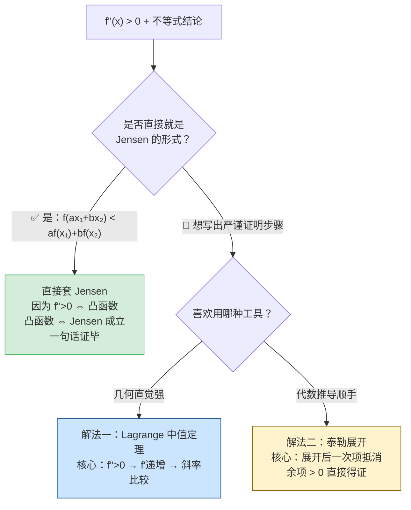

# 考研常用基本不等式

> 📌 **本章内容**：代数不等式、函数不等式、积分不等式、琴生不等式

---

## 一、代数不等式

| 不等式 | 公式 | 取等条件 |
|:---|:---|:---:|
| **基本不等式** | $a^2 + b^2 \ge 2ab$ | $a = b$ |
| **AM–GM（二元）** | $\dfrac{a+b}{2} \ge \sqrt{ab}\;(a,b\ge 0)$ | $a = b$ |
| **AM–GM（$n$ 元）** | $\dfrac{a_1 + a_2 + \cdots + a_n}{n} \ge \sqrt[n]{a_1a_2\cdots a_n}\;(a_i\ge 0)$ | $a_1 = a_2 = \cdots = a_n$ |
| **AM–GM 推广** | $\dfrac{a}{b} + \dfrac{b}{a} \ge 2\;(ab>0)$ | $a = b$ |
| **柯西–施瓦茨** | $(\sum a_i^2)(\sum b_i^2) \ge (\sum a_i b_i)^2$ | $\dfrac{a_1}{b_1} = \dfrac{a_2}{b_2} = \cdots$ |
| **三角不等式** | $\|a\| - \|b\|\le \|a \pm b\| \le \|a\| + \|b\|$ | 同号/异号时取等 |
| **排序不等式** | 顺序和 $\ge$ 乱序和 $\ge$ 逆序和 | — |
| **伯努利不等式** | $(1+x)^n \ge 1 + nx\;(x > -1,\;n\in\mathbb{N}^+)$ | $x = 0$ |
| **伯努利推广** | $(1+x)^\alpha \ge 1 + \alpha x\;(x > -1,\;\alpha>1\;\text{或}\;\alpha<0)$ | $x = 0$ |

---

## 二、函数不等式（考研高频！）

> 以下均在定义域内成立，常用于极限放缩、导数证明题。

| 不等式 | 示意图 |
|:---|:---:|
| $e^x \ge 1 + x\;(\forall x\in\mathbb{R})$ | $e^x$ 在 $(0,1)$ 处切线 |
| $\ln(1+x) \le x\;(x > -1)$ | $\ln(1+x)$ 在 $(0,0)$ 处切线 |
| $\dfrac{x}{1+x} < \ln(1+x) < x\;(x > 0)$ | 双边放缩 |
| $\sin x < x < \tan x\;(x > 0)$ | 单位圆中的三角函数线 |
| $\arctan x < x < \arcsin x\;(0 < x < 1)$ | 反三角函数放缩 |
| $\dfrac{1}{1+x} < \ln\!\left(1+\dfrac{1}{x}\right) < \dfrac{1}{x}\;(x > 0)$ | 积分放缩 |

---

## 三、积分不等式

| 不等式 | 公式 |
|:---|:---|
| **柯西–施瓦茨（积分型）** | $\displaystyle\left(\int_a^b f(x)g(x)\,dx\right)^2 \le \int_a^b f^2(x)\,dx \cdot \int_a^b g^2(x)\,dx$ |
| **积分保序性** | 若 $f(x) \le g(x)$ 则 $\displaystyle\int_a^b f(x)\,dx \le \int_a^b g(x)\,dx$ |
| **积分估值** | $m(b-a) \le \displaystyle\int_a^b f(x)\,dx \le M(b-a)$，其中 $m \le f(x) \le M$ |
| **积分中值定理** | $\displaystyle\int_a^b f(x)\,dx = f(\xi)(b-a),\;\xi\in[a,b]$ |

---

## 四、琴生不等式（Jensen）

若 $f(x)$ 为区间 $I$ 上的**凸函数**（$f''(x) \ge 0$），则对 $\forall x_i\in I$：

$$
f\!\left(\frac{x_1 + x_2 + \cdots + x_n}{n}\right) \le \frac{f(x_1) + f(x_2) + \cdots + f(x_n)}{n}
$$

若 $f$ 为**凹函数**（$f''(x) \le 0$），不等号反向。

> **考研常见凸函数**：$x^2$、$e^x$、$x\ln x$、$-\ln x$
>
> **考研常见凹函数**：$\sqrt{x}$、$\ln x$、$\sin x$（$[0,\pi]$）

### 例题1：凸函数的 Jensen 不等式（二元形式）

> **题目**：设 $f''(x) > 0$，$a, b > 0$ 且 $a + b = 1$，$x_1 \neq x_2$。证明：
>
> $$f(ax_1 + bx_2) < af(x_1) + bf(x_2)$$

**思路分析**：

$f''(x) > 0$ 意味着 $f$ 是严格凸函数。本题本质是证明**凸函数定义等价于 Jensen 不等式**。

---

**🧭 为什么选这两种方法？——决策逻辑**

拿到这道题，看到条件 `f''(x) > 0` + 要证 `f(加权平均) < 加权的f值`，可以这样选择方法：

| 方法 | 核心逻辑 | 什么时候优先用 |
|:---|:---|:---|
| **Jensen 直接套** | $f''>0 \iff$ 凸 $\iff$ Jensen，一句话 | 题目就是 Jensen 标准形式时（最快）|
| **Lagrange（解法一）** | $f''>0 \implies f'$ 递增 $\implies$ 割线斜率递增 | 几何直观强，适合"比较斜率"类题型 |
| **泰勒展开（解法二）** | 在 $z=ax_1+bx_2$ 处展开，一次项抵消，余项 $>0$ | **万能打法**——任何 $f''$ 条件的不等式都能用 |

> 💡 **考场建议**：如果题目直接是 Jensen 的形式（如本题），写"由 $f''>0$ 知 $f$ 凸，由 Jensen 不等式得证"即可拿分。如果题目是变体（如带积分、带特殊点），优先用**泰勒展开+余项**，因为它是处理二阶导数条件的固定套路，不需要太多技巧。

---

**解法一：利用凸函数的斜率递增性**

令 $z = ax_1 + bx_2$，由 $a + b = 1$ 知 $z$ 是 $x_1$ 与 $x_2$ 的加权平均，且 $z$ 介于 $x_1$ 与 $x_2$ 之间（因 $a,b > 0$，不妨设 $x_1 < x_2$，则 $x_1 < z < x_2$）。

要证 $f(z) < af(x_1) + bf(x_2)$，即：
$$f(z) - f(x_1) < b\,[f(x_2) - f(x_1)]$$

由 Lagrange 中值定理，存在 $\xi_1 \in (x_1, z)$，$\xi_2 \in (z, x_2)$，使得：
$$\frac{f(z) - f(x_1)}{z - x_1} = f'(\xi_1),\quad \frac{f(x_2) - f(z)}{x_2 - z} = f'(\xi_2)$$

由 $f'' > 0$ 知 $f'$ 单调递增，且 $\xi_1 < \xi_2$，故 $f'(\xi_1) < f'(\xi_2)$：

$$\frac{f(z) - f(x_1)}{z - x_1} < \frac{f(x_2) - f(z)}{x_2 - z}$$

将 $z = ax_1 + bx_2$ 代入：$z - x_1 = b(x_2 - x_1)$，$x_2 - z = a(x_2 - x_1)$

$$\frac{f(z) - f(x_1)}{b(x_2-x_1)} < \frac{f(x_2) - f(z)}{a(x_2-x_1)}$$

两边同乘 $(x_2-x_1) > 0$ 并交叉相乘：
$$a\,[f(z) - f(x_1)] < b\,[f(x_2) - f(z)]$$
$$a f(z) - a f(x_1) < b f(x_2) - b f(z)$$
$$(a+b)f(z) < af(x_1) + bf(x_2)$$

由 $a + b = 1$，得证 $f(ax_1+bx_2) < af(x_1) + bf(x_2)$。$\square$

---

**解法二：泰勒展开法（更简洁）**

将 $f(x_1)$ 和 $f(x_2)$ 分别在 $z = ax_1 + bx_2$ 处泰勒展开（带 Lagrange 余项）：

$$
\begin{aligned}
f(x_1) &= f(z) + f'(z)(x_1 - z) + \frac{f''(\xi_1)}{2}(x_1 - z)^2,\quad \xi_1 \text{ 介于 } x_1,z \text{ 之间} \\[4pt]
f(x_2) &= f(z) + f'(z)(x_2 - z) + \frac{f''(\xi_2)}{2}(x_2 - z)^2,\quad \xi_2 \text{ 介于 } x_2,z \text{ 之间}
\end{aligned}
$$

将第一式乘 $a$、第二式乘 $b$ 后相加：

$$
\begin{aligned}
af(x_1) + bf(x_2) &= (a+b)f(z) + f'(z)[a(x_1-z) + b(x_2-z)] \\
&\quad + \frac{a}{2}f''(\xi_1)(x_1-z)^2 + \frac{b}{2}f''(\xi_2)(x_2-z)^2
\end{aligned}
$$

由于 $z = ax_1 + bx_2$ 且 $a+b=1$：
$$a(x_1-z) + b(x_2-z) = 0$$

又由 $f'' > 0$ 且 $x_1 \neq x_2$，后两项严格大于零，故：
$$af(x_1) + bf(x_2) = f(z) + \text{正项} > f(z) = f(ax_1+bx_2)$$

得证。$\square$

---

**✅ 答案**：$f(ax_1+bx_2) < af(x_1) + bf(x_2)$（$f''>0$ 保证严格凸，$x_1 \neq x_2$ 时严格不等号）

**💡 启示/要点**：

| 要点 | 说明 |
|:---|:---|
| $f'' > 0 \iff f'$ 单调递增 $\iff$ 严格凸 | 三种表述等价，择一使用 |
| Jensen 的二元形式 | $f(ax_1+bx_2) \le af(x_1) + bf(x_2)$ 即凸函数定义 |
| 泰勒展开+余项 | 处理二阶导数条件的"杀手锏"手段 |
| 解法一的本质 | 斜率递增 → 割线在上 → 凸性 |

---

> 📎 **关联文件**：[返回考研总览](/)
